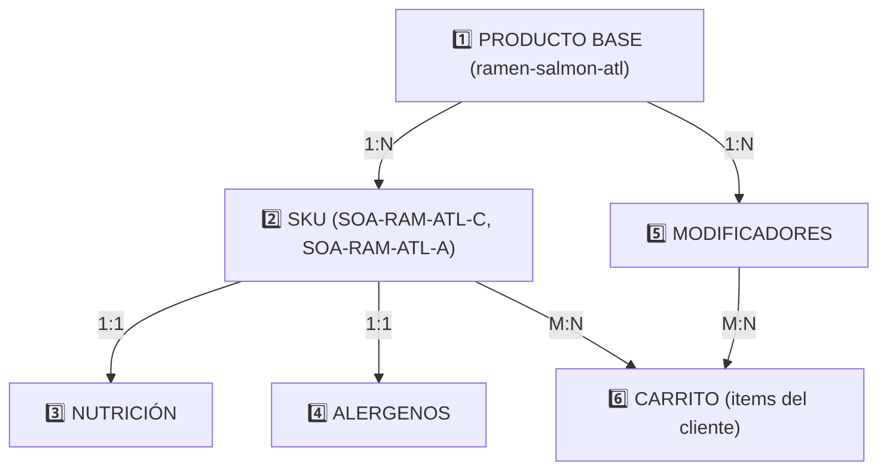

# 🏗️ Modelo de Datos Estratificado - Makilovers

**Documento de Arquitectura | Versión 1.0 | 8 de Marzo de 2026**

---

## 📊 Resumen Ejecutivo

El modelo actual de `menu.json` es **insuficiente** para operaciones financieras y nutricionales reales. Se propone un modelo **estratificado en 5 capas** que soporta:

- ✅ Productos con múltiples SKUs (mismos nombres, diferente precio por cantidad)
- ✅ Precios NO lineales (escalas de descuento)
- ✅ Información nutricional compleja (diabéticos, restricciones)
- ✅ Alergenos avanzados (trazas, componentes específicos)
- ✅ Modificadores dinámicos (sin impacto en precio)

---

## 🔄 Transición: De Flat a Estratificado

### ANTES (menu.json simplista)
```json
{
  "sopas": {
    "platos": [
      {
        "codigo": "SO-RAM-C",
        "nombre": "Ramen de la Casa",
        "precio": { "corto": 25, "amplio": 35 },
        "alergenosPrincipales": ["gluten"]
      }
    ]
  }
}
```

**Problemas:**
- Precio lineal ficción (no representa realidad)
- Sin información nutricional
- Alergenos básicos (sin trazas ni componentes)
- Sin modificadores

### DESPUÉS (Firestore escalable)
```
Firestore
├── productos/
│   ├── {id}: { nombre, categoría, disponibilidad }
├── skus/
│   ├── {skuId}: { presentación, precios, nutrición, alergenos }
├── modificadores/
│   ├── {modId}: { nombre, opciones, precios }
└── carrito/
    ├── {userId}/items[]: { skuId, cantidad, modificadores }
```

---

## 🏛️ CAPA 1: PRODUCTO BASE

**Responsabilidad:** Identidad del producto (lo que ven los clientes)

```javascript
// Firestore: /productos/{productoId}
{
  id: "ramen-salmon-atl",
  codigo: "SOA-RAM-ATL",           // Para búsqueda legacy
  
  // Identidad
  nombre: "Ramen de Salmón Atlántico",
  descripcion: "Caldo umami con fideos artesanales, salmón fresco y toppings premium",
  categoria: "SOPAS",
  subcategoria: "Ramén Nikkei",
  
  // Metadatos
  slug: "ramen-salmon-atlantico",
  tags: ["popular", "recomendado", "picante"],
  
  // Disponibilidad
  disponibilidad: {
    estado: true,
    horario: {
      lunes: { apertura: "11:00", cierre: "22:30" },
      martes: { apertura: "11:00", cierre: "22:30" },
      // ... resto de días
      domingo: { apertura: "12:00", cierre: "21:00" }
    },
    diasCerrado: ["25-12", "01-01"]  // Fechas especiales
  },
  
  // SEO
  seo: {
    title: "Ramen de Salmón Atlántico | Makilovers",
    description: "Auténtico ramen Nikkei con salmón fresco del Atlántico, caldo umami y fideos artesanales",
    keywords: ["ramen", "salmón", "nikkei", "fusión"]
  }
}
```

---

## 🏛️ CAPA 2: SKU (VARIANTE FÍSICA)

**Responsabilidad:** Presentación física del producto + Precio

```javascript
// Firestore: /skus/{skuId}
{
  skuId: "SOA-RAM-ATL-C",
  productoId: "ramen-salmon-atl",
  
  // PRESENTACIÓN (CRÍTICO PARA FINANZAS)
  presentacion: {
    nombre: "Ramen de Salmón - Porción Corta",
    cantidad: 1,
    unidad: "plato",
    contenedorTipo: "bowl-cerámica-28cm",
    pesoNeto: { valor: 400, unidad: "g" },
    pesoBruto: { valor: 420, unidad: "g" }
  },
  
  // PRECIOS NO LINEALES
  precios: {
    precioUnitario: 22.00,           // Referencial
    precioVenta: 25.00,              // Lo que paga cliente
    costoProduccion: 9.50,           // Costo real (salmón, fideos, caldo, etc)
    
    margenBruto: {
      valor: 15.50,
      porcentaje: 62.0               // (25-9.5)/25 * 100
    },
    
    // IMPUESTOS
    impuesto: {
      tipo: "IGV",
      porcentaje: 18,
      monto: 4.50
    },
    
    precioFinal: 29.50,              // Con IGV
    
    // HISTÓRICO (para auditoría)
    historialPrecios: [
      {
        precio: 25.00,
        desde: "2026-03-08T00:00:00Z",
        hasta: null,
        razon: "Precio inicial"
      },
      {
        precio: 22.00,
        desde: "2026-01-15T00:00:00Z",
        hasta: "2026-03-07T23:59:59Z",
        razon: "Promoción Q1 2026"
      }
    ]
  },
  
  // ESCALAS DE DESCUENTO (MULTI-UNIT ORDERS)
  escalaDescuentos: [
    {
      minCantidad: 1,
      maxCantidad: 1,
      multiplicador: 1.00,
      descripcion: "Precio normal"
    },
    {
      minCantidad: 2,
      maxCantidad: 5,
      multiplicador: 0.95,
      descripcion: "5% descuento",
      aplicadoDesde: "2026-03-08"
    },
    {
      minCantidad: 6,
      maxCantidad: 12,
      multiplicador: 0.90,
      descripcion: "10% descuento (catering)",
      aplicadoDesde: "2026-03-08"
    },
    {
      minCantidad: 13,
      maxCantidad: 999,
      multiplicador: 0.85,
      descripcion: "15% descuento (evento)"
    }
  ],
  
  // SEGUNDO SKU DEL MISMO PRODUCTO
  relacionados: ["SOA-RAM-ATL-A"]  // Link a porción amplia
}
```

**OTRO SKU del mismo producto:**

```javascript
{
  skuId: "SOA-RAM-ATL-A",
  productoId: "ramen-salmon-atl",
  
  presentacion: {
    nombre: "Ramen de Salmón - Porción Amplia",
    cantidad: 1,
    unidad: "plato",
    pesoNeto: { valor: 650, unidad: "g" }
  },
  
  precios: {
    precioUnitario: 35.00,
    costoProduccion: 14.50,
    margenBruto: { valor: 20.50, porcentaje: 58.6 }
    // ... resto
  }
}
```

---

## 🏛️ CAPA 3: NUTRICIÓN + RESTRICCIONES

**Responsabilidad:** Info médica/dietética (diabéticos, alergias, etc)

```javascript
// Firestore: /nutricion/{skuId}
{
  skuId: "SOA-RAM-ATL-C",
  
  macronutrientes: {
    calorias: 520,
    proteina: { valor: 28, unidad: "g" },
    grasas: {
      total: { valor: 18, unidad: "g" },
      saturadas: { valor: 5, unidad: "g" },
      insaturadas: { valor: 13, unidad: "g" },
      transGrasas: { valor: 0, unidad: "g" }
    },
    carbohidratos: {
      total: { valor: 48, unidad: "g" },
      fibra: { valor: 3, unidad: "g" },
      azucar: { valor: 4, unidad: "g" }
    }
  },
  
  // MICRONUTRIENTES - CRÍTICOS PARA DIABÉTICOS
  micronutrientes: {
    // Glucosa equivalente
    glucosaEquivalente: {
      valor: 40,
      unidad: "g",
      formula: "Carbs - 0.5*Fibra",  // Para diabéticos insulino-dependientes
      notaEspecial: "MODERADO_DIABETICOS"
    },
    
    indiceGlucemico: {
      valor: 65,
      clasificacion: "MEDIO",
      cargaGlucermica: 31
    },
    
    // Electrolitos críticos
    sodio: { valor: 1200, unidad: "mg", recomendacion: "Alto - restricción hipertensión" },
    potasio: { valor: 380, unidad: "mg", recomendacion: "Normal" },
    calcio: { valor: 25, unidad: "mg" },
    hierro: { valor: 3.2, unidad: "mg" },
    magnesio: { valor: 45, unidad: "mg" },
    zinc: { valor: 2.1, unidad: "mg" }
  },
  
  // RESTRICCIONES BOOLEANAS
  restricciones: {
    diabetes: {
      recomendado: true,
      nivel: "MODERADO",
      razon: "40g glucosa equivalente (monitoreo recomendado)",
      notaCliente: "Consultar con nutricionista"
    },
    hipertension: {
      recomendado: false,
      nivel: "ALTO_SODIUM",
      razon: "1200mg sodio (supera 50% recomendación diaria)",
      alternativa: "Solicitar sin sal adicional"
    },
    insuficienciaRenal: {
      recomendado: false,
      nivel: "ALTO_POTASIO",
      razon: "Alto potasio (380mg)"
    },
    celiaquos: {
      recomendado: false,
      razon: "Contiene gluten en fideos",
      alternativa: "Ofrecer versión sin gluten"
    },
    veganos: {
      recomendado: false,
      razon: "Contiene salmón (pescado)"
    },
    vegetarianos: {
      recomendado: false,
      razon: "Contiene salmón"
    },
    kosher: {
      recomendado: false,
      razon: "Pescado sin escamas permitidas"
    },
    halal: {
      recomendado: false,
      razon: "Pescado no halal certificado"
    }
  }
}
```

---

## 🏛️ CAPA 4: ALERGENOS AVANZADOS

**Responsabilidad:** Trazabilidad completa de alérgenos

```javascript
// Firestore: /alergenos/{skuId}
{
  skuId: "SOA-RAM-ATL-C",
  
  // ALÉRGENOS DECLARADOS (responsabilidad legal)
  declarados: ["pescado", "gluten", "soya", "mariscos"],
  
  // TRAZAS (contacto cruzado durante preparación)
  trazas: ["frutos secos", "sésamo"],
  
  // COMPONENTES ESPECÍFICOS CON DESCOMPOSICIÓN
  componentes: [
    {
      nombre: "Salmón Atlántico",
      alergenoCategoria: "PESCADO",
      cantidadPorcentaje: 40,
      proveedor: "Premium Seafood Ltd",
      paisOrigen: "Noruega",
      certificaciones: ["MSC-Sostenible", "EU-Organic"],
      numeroLote: "ATL-2026-03-001",
      fechaVencimiento: "2026-03-25"
    },
    {
      nombre: "Fideos Ramen (Trigo Integral)",
      alergenoCategoria: "GLUTEN",
      cantidadPorcentaje: 35,
      proveedor: "Artisan Noodles Co",
      paisOrigen: "Japón",
      certificaciones: ["Orgánico"],
      numeroLote: "NOOD-2026-02-015",
      fechaVencimiento: "2026-06-30"
    },
    {
      nombre: "Caldo Base (Miso + Bonito)",
      alergenoCategoria: "SOYA, PESCADO",
      cantidadPorcentaje: 20,
      detalle: "Miso a base de soya fermentada + caldo dashi con bonito desecado",
      proveedor: "Traditional Miso House",
      numeroLote: "MISO-2026-02-080",
      fechaVencimiento: "2026-08-15"
    },
    {
      nombre: "Edamame (Brotes)",
      alergenoCategoria: "SOYA",
      cantidadPorcentaje: 3,
      proveedor: "Fresh Organic Farms",
      paisOrigen: "Peru",
      numeroLote: "EDA-2026-03-042"
    },
    {
      nombre: "Maíz Dulce (Topping)",
      alergenoCategoria: null,
      cantidadPorcentaje: 2,
      proveedor: "Local Agriculture"
    }
  ],
  
  // MATRIZ DE CRUCE DE ALERGENOS
  matrizCruce: {
    "pescado-soya": true,        // Comparten en same dish
    "gluten-soya": true,
    "frutos_secos-cereales": false  // No hay contacto
  },
  
  // MÉTODOS DE PREPARACIÓN (CONTAMINACIÓN CRUZADA)
  preparacion: {
    area: "ZONA_CALIENTE_SOPAS",
    utensilios: ["cucharón-dedicado", "cuchara-madera"],
    equipoCompartido: ["cocina-industrial", "corte-tabla-1"],
    
    protocoloLimpieza: {
      frecuencia: "Entre cada plato",
      desinfectante: "Cloro 200ppm",
      tiempoContacto: "1 minuto",
      enjuague: "Agua corriente estéril"
    }
  },
  
  // AVISO LEGAL OBLIGATORIO
  avisoLegal: "Este producto puede contener trazas de frutos secos y sésamo. Consumidores con alergias severas deben consultar personalizado con el chef antes de ordenar.",
  
  ultimaActualizacion: "2026-03-08T10:30:00Z",
  auditadoPor: "Chef de Cocina + Nutricionista"
}
```

---

## 🏛️ CAPA 5: MODIFICADORES (SIN IMPACTO PRECIO)

**Responsabilidad:** Variaciones dinámicas que NO cambian precio

```javascript
// Firestore: /modificadores/{productoId}
{
  productoId: "ramen-salmon-atl",
  
  modificadores: [
    {
      id: "MOD-WASABI-LEVEL",
      nombre: "Nivel de Wasabi",
      tipo: "SELECTOR_UNICO",
      obligatorio: false,
      opciones: [
        { id: "sin", label: "Sin Wasabi", precioAjuste: 0, notaNutricion: "-" },
        { id: "bajo", label: "Poco (Suave)", precioAjuste: 0, notaNutricion: "Mínimo" },
        { id: "normal", label: "Normal (Recomendado)", precioAjuste: 0, notaNutricion: "Moderado" },
        { id: "alto", label: "Extra Picante", precioAjuste: 0, notaNutricion: "Alto" }
      ],
      default: "normal"
    },
    {
      id: "MOD-TEMP-COCCION",
      nombre: "Temperatura del Caldo",
      tipo: "SELECTOR_UNICO",
      obligatorio: false,
      opciones: [
        { id: "caliente", label: "Bien Caliente (95°C)", precioAjuste: 0 },
        { id: "templado", label: "Templado (70°C)", precioAjuste: 0 },
        { id: "frio", label: "Frío (Hiyamen)", precioAjuste: 1.00 }  // Variante diferente
      ],
      default: "caliente"
    },
    {
      id: "MOD-TOPPINGS",
      nombre: "Toppings Adicionales",
      tipo: "MULTISELECT",
      obligatorio: false,
      limite: 3,
      opciones: [
        { id: "huevo", label: "Huevo Poche Extra", precioAjuste: 0 },
        { id: "ajo", label: "Ajo Tostado Extra", precioAjuste: 0 },
        { id: "bamboo", label: "Brotes Bamboo", precioAjuste: 0 },
        { id: "alga-nori", label: "Alga Nori Crujiente", precioAjuste: 0.50 }
      ]
    },
    {
      id: "MOD-VERDURAS",
      nombre: "Verduras - Preferencias",
      tipo: "MULTISELECT",
      obligatorio: false,
      opciones: [
        { id: "cebolla-morada", label: "Cebolla Morada (+ ácido)", precioAjuste: 0 },
        { id: "zanahoria", label: "Zanahoria Juliana", precioAjuste: 0 },
        { id: "brocoli", label: "Brócoli Al Dente", precioAjuste: 0 },
        { id: "sin-verduras", label: "Sin Verduras Crudas", precioAjuste: 0 }
      ]
    }
  ]
}
```

---

## 📦 CAPA 6 (TRANSACCIÓN): CARRITO

**Responsabilidad:** Lo que termina en orden/invoice

```javascript
// Firestore: /carrito/{userId}/items/{itemId}
{
  itemId: "ITEM-20260308-001",
  usuarioId: "user-12345",
  skuId: "SOA-RAM-ATL-C",
  
  cantidad: 2,  // Dos porciones
  
  precioUnitario: 25.00,
  
  // Aplicar escala de descuento
  cantidadDescuento: 2,           // 2 unidades = 5% descuento
  multiplicadorDescuento: 0.95,
  precioConDescuento: 23.75,
  
  subtotal: 47.50,  // 23.75 * 2
  impuesto: 8.55,   // IGV
  total: 56.05,
  
  // MODIFICADORES SELECCIONADOS (auditoría + preparación)
  modificadoress: {
    "MOD-WASABI-LEVEL": "alto",
    "MOD-TEMP-COCCION": "caliente",
    "MOD-TOPPINGS": ["huevo", "ajo"],
    "MOD-VERDURAS": ["cebolla-morada", "zanahoria"]
  },
  
  // NUTRICIÓN AGREGADA (calculada)
  nutricionAgregada: {
    cantidad: 2,
    calorias: 1040,
    proteina: 56,
    carbohidratos: 96,
    sodio: 2400,  // ⚠️ DUPLICADO - aviso a hipertensión
    glucosaEquivalente: 80
  },
  
  // ALERGENOS FINALES (para cocina + cliente)
  alergenosFinales: ["pescado", "gluten", "soya", "mariscos"],
  trazasFinales: ["frutos secos", "sésamo"]
  
  notasEspeciales: "CLIENTE HIPERTENSIÓN: Alto sodio. Modificador Wasabi alto.",
  
  timestamp: "2026-03-08T15:30:45Z",
  estado: "pendiente-confirmacion"
}
```

---

## 🔗 RELACIONES ENTRE CAPAS



---

## ✅ VENTAJAS DEL MODELO

| Aspecto | Beneficio |
|---------|-----------|
| **Finanzas** | Margen visible por SKU, escalas de descuento, historial precios |
| **Nutrición** | Información detallada para diabéticos, insuficiencia renal, etc. |
| **Alergenos** | Trazabilidad completa, conformidad legal |
| **Operaciones** | Modificadores para cocina sin cambiar inventario |
| **UX** | Cliente ve info médica personalizada ("No recomendado hipertensión") |
| **Auditoría** | Logger completo de cambios de precio, componentes, proveedores |

---

## 🚀 ROADMAP DE IMPLEMENTACIÓN

**Fase 1 (Semana 1-2):** Definir estructura exacta con cliente  
**Fase 2 (Semana 3-4):** Migrar `menu.json` → Schema Firestore  
**Fase 3 (Semana 5-6):** Actualizar `menuService.js` con capas  
**Fase 4 (Semana 7-8):** Frontend para mostrar nutrición/alergenos  
**Fase 5 (Semana 9+):** Admin dashboard para gestión  

---

> **Documento vivo | Próxima revisión: Cuando cliente valide estructura**
